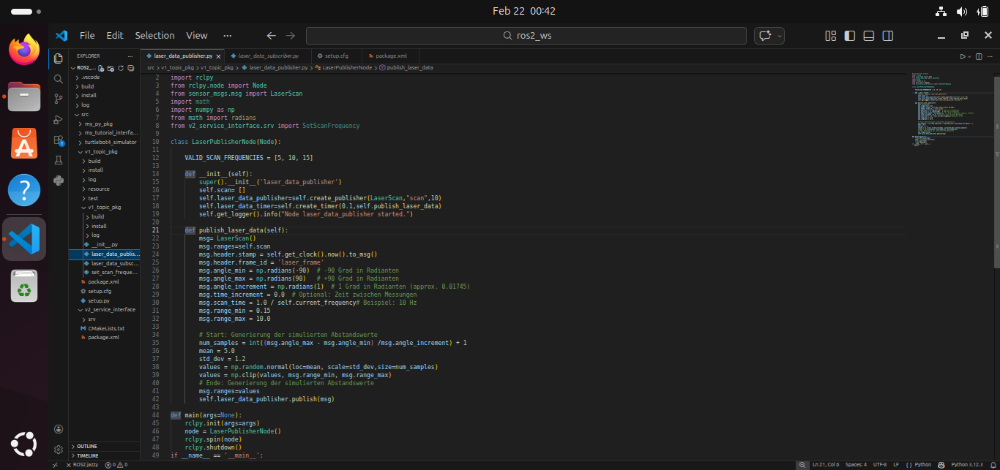
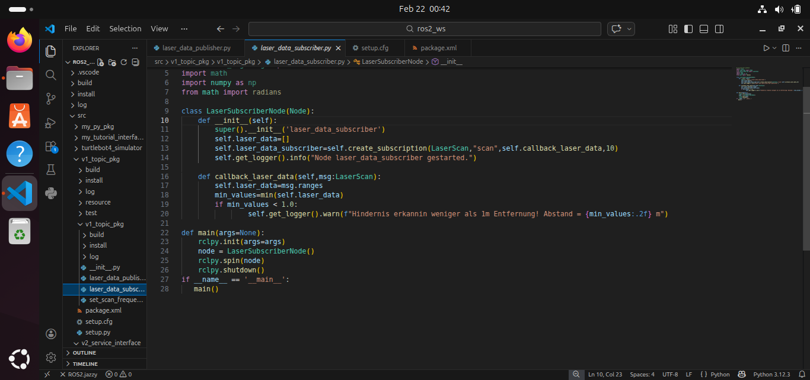
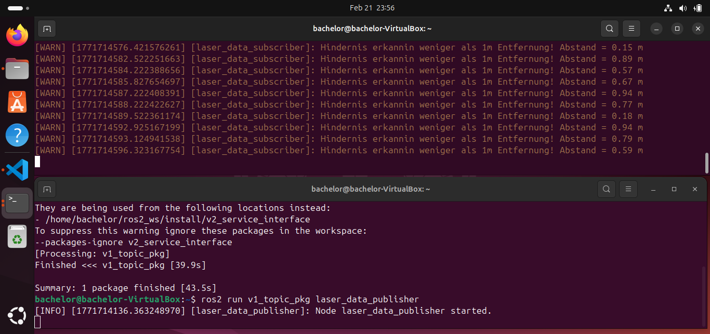

# Praktikum-Hochschule-Robotik-Topics
akademisches Praktikum-ROS2-Topics / Elektrotechnik / Labor
Hochschule : Technische Hochschule Georg Agricola
Wissenschaftsbereich : Elektrotechnik (BET-Energietechnik)
Team : 2 Studenten

    Praktikumsbeschreibung

Dieses Projekt implementiert das Publish-Subscribe-Prinzip in ROS2 zur Simulation und Verarbeitung von 2D-Laserscandaten.
Im Rahmen dieses Projekts werden:
Ein Publisher programmiert, der simulierte Laserscandaten veröffentlicht
Ein Subscriber implementiert, der die Daten auswertet
Die Funktionalität in der Simulationsumgebung Gazebo mit dem TurtleBot 4 getestet
Ziel ist es, die grundlegende Kommunikationsstruktur von ROS2 über Topics zu verstehen und praktisch umzusetzen.

    Systemarchitektur

    Architekturüberblick
Das System basiert auf dem Publish-Subscribe-Modell:
Der Publisher-Node veröffentlicht Laserscandaten auf dem Topic scan.
Der Subscriber-Node empfängt diese Daten.
Die Kommunikation erfolgt über den Nachrichtentyp sensor_msgs/msg/LaserScan.
Kommunikationsprinzip
Keine direkte Verbindung zwischen Publisher und Subscriber
Entkoppelte Kommunikation über Topics
Standardisierter Nachrichtentyp ermöglicht modulare Systemarchitektur

    Projektstruktur
ros2_ws/
 ├── src/
 │   ├── v1_topic_pkg/
 │       ├── laser_data_publisher.py
 │       ├── laser_data_subscriber.py

    Verwendete Technologien
ROS2
Python 3
sensor_msgs
NumPy
Gazebo
TurtleBot 4 (Clearpath Robotics)
     
     Teil 1 – Publisher
Node: laser_data_publisher

Der Publisher simuliert die Abstandswerte eines 2D-Laserscanners und veröffentlicht sie mit einer Frequenz von 10 Hz auf dem Topic:

        Eigenschaften des simulierten Laserscanners
Parameter	Wert
Startwinkel	-90°
Endwinkel	+90°
Scanbereich	180°
Winkelauflösung	1°
Messbereich	0.15 m – 10.0 m
Scanfrequenz	10 Hz

        Implementierung

Verwendung des Nachrichtentyps LaserScan
Erzeugung zufälliger Abstandswerte mittels Normalverteilung
Begrenzung der Werte auf den gültigen Messbereich
Periodisches Publishen über einen ROS2-Timer

    Teil 2 – Subscriber
Node: laser_data_subscriber
Der Subscriber empfängt die Laserscandaten vom Topic scan und analysiert die Abstandswerte.

        Funktion
Speicherung der empfangenen Messwerte
Ermittlung des Minimalwerts
Ausgabe einer Warnmeldung, wenn ein Abstand < 1 m ist
Beispielausgabe
Achtung: Hindernis in weniger als 1 m Entfernung! Abstandswert: 0.8 m

Praxisbezug:
Simulation einer Hinderniserkennung bei einem mobilen Roboter.

    Teil 3 – Gazebo Simulation

Im letzten Teil wird der selbst programmierte Publisher durch die Gazebo-Simulation ersetzt.
Die Laserdaten stammen nun vom simulierten TurtleBot 4, werden aber weiterhin auf dem Topic scan im gleichen Nachrichtentyp veröffentlicht.

    Vorteil

Der Subscriber funktioniert ohne Codeänderung, da:
Das Topic identisch ist
Der Nachrichtentyp identisch ist
ROS2-Nodes entkoppelt arbeiten
Dies demonstriert die Modularität und Austauschbarkeit innerhalb des ROS2-Frameworks.

         Projekt ausführen
Workspace bauen
cd ~/ros2_ws
colcon build
source install/setup.bash

        Publisher starten
ros2 run v1_topic_pkg laser_data_publisher

        Subscriber starten
ros2 run v1_topic_pkg laser_data_subscriber

        simulation im Terminal

        Simulation starten (Gazebo)
ros2 launch turtlebot4_gz_bringup turtlebot4_gz.launch.py

        Zentrale ROS2-Konzepte
Konzept                 	Bedeutung
Workspace	                Entwicklungsumgebung für ROS2-Packages
Package	                  Modul mit Nodes und Abhängigkeiten
Node	                    Eigenständiges ROS2-Programm
Topic                   	Kommunikationskanal
Publisher	                Sendet Nachrichten
Subscriber              	Empfängt Nachrichten
spin()	                  Event-Loop zur Verarbeitung von Callbacks
Timer	                    Periodische Ausführung einer Funktion

    Lernziele & Erworbene Kompetenzen
        Fachliche Kompetenzen
Verständnis des Publish-Subscribe-Prinzips in ROS2
Verwendung des Nachrichtentyps LaserScan
Implementierung von Publisher- und Subscriber-Nodes
Verarbeitung von Sensordaten in Echtzeit
Integration in eine Simulationsumgebung

        Programmiertechnische Kompetenzen
Objektorientierte Python-Programmierung
Nutzung von ROS2-APIs (rclpy)
Arbeiten mit Timern und Callback-Methoden
Strukturierung eines ROS2-Workspaces
Debugging und Logging in ROS2

        Robotik-Kompetenzen
Simulation eines 2D-Laserscanners
Hinderniserkennung auf Basis von Sensordaten
Verständnis modularer Robotersysteme
Austauschbarkeit von Komponenten (Simulation ↔ Eigene Implementierung)
